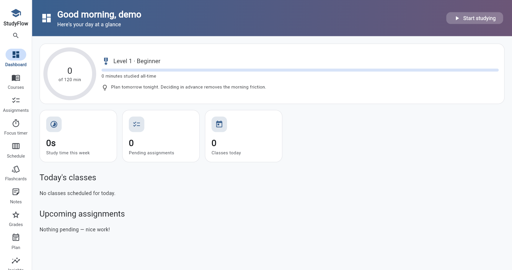
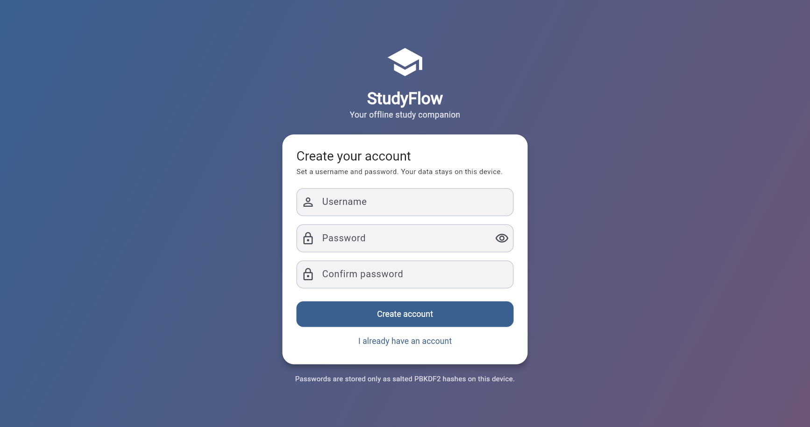

# StudyFlow

StudyFlow is a study planner I built to keep all my coursework in one place instead of spreading it across sticky notes and a few different apps. You add your courses, drop in your assignments with due dates, run a focus timer while you study, keep track of your grades, and drill flashcards. Everything is saved on your own computer and the whole thing works offline, so no internet is needed once it is open.

I wrote it in Flutter (Dart) and it stores everything in a local SQLite database through the drift package. There is a small account system so more than one person can use the same machine and keep their data separate.



## What it does

- **Accounts.** Create a local account and sign in. Each account keeps its own study data on the device. More on how that is handled in the security section below.
- **Dashboard.** A friendly greeting, your classes today, the assignments coming up soonest, how much you have studied this week, a heads up for anything due within 48 hours, and a button that jumps straight into a focus session.
- **Courses.** Add, edit and delete courses, each with an instructor and a colour. Every course shows its total study time and how many assignments are still open.
- **Assignments.** Add, edit, delete and tick them off. Set a priority, a due date and a rough estimate of how long it will take. Search them and filter by course, status or priority.
- **Focus timer.** A Pomodoro style timer that you can adjust. Pick the course, then start, pause or reset. Finished study blocks are saved on their own. You can leave a note on a session and tap a button whenever you get distracted. A little plant in the corner grows the more you study, and you get a longer break every few rounds.
- **Weekly schedule.** Add your recurring class times for each day. These also feed the classes today list on the dashboard.
- **Flashcards.** Build decks per course and review them with spaced repetition, the same idea Anki uses. If you have a local AI model running you can paste your notes and it drafts cards for you.
- **Notes.** Keep free form notes per course, and turn any note into flashcards with one tap when the AI is available.
- **Study plan.** Give your assignments a rough time estimate and it spreads the work across the days before each one is due, soonest deadlines first, capped by how much you want to study per day. It warns you when something will not fit in time.
- **Grades.** Break a course into weighted pieces like a midterm and a final, see your current grade, letter and GPA point, and work out what you still need on the rest to hit a target.
- **Insights.** A bar chart of study time per course, an activity heatmap over the last twelve weeks, your daily streak, achievement badges, and how much of your studying happens at the last minute.
- **Export and backup.** Save a weekly PDF report, send your assignments and classes to a calendar file for Google or Outlook, and back up or restore everything as a JSON file that you can optionally lock with a passphrase.
- **Themes and settings.** Light, dark or system mode, ten accent colours that recolour the whole app, and a text size option. You can also set your default timer lengths, your daily study goal, and which AI model to use.
- **Small touches.** Press Ctrl+K anywhere for a quick jump menu, watch an XP level climb as you study, read a study tip of the day, and get a little confetti when you finish a session. The timer also responds to the spacebar.



## The optional local AI

The flashcard maker and the plain English quick add for assignments talk to a local model through [Ollama](https://ollama.com), so nothing ever leaves your computer. These bits only show up when Ollama is running with a model pulled, and the rest of the app is completely happy without it. I tested with the small qwen2.5:0.5b model and a bigger one writes noticeably better cards. The launcher passes the requests through to Ollama so the browser never has to.

## Security and your data

I wanted to handle passwords properly, so here is what actually happens:

- Passwords are never saved. Only a salted PBKDF2 hash (with a high iteration count) is kept, and signing in re derives it and compares in constant time.
- Every account gets its own separate local database.
- Backups can be encrypted with AES 256 GCM using a key made from a passphrase you pick, so a backup file is useless to anyone without it.

Being straight about what this is: StudyFlow is a local, offline app with no server. The login guards the app itself and the encrypted backups protect files you share, but the live database sits in this computer's local storage, so someone with direct access to the machine's files could still read it without the password. There is no server enforcing anything. Real security that nobody can get around would need a proper backend holding the data, which is beyond an offline build like this one. Sharing the source code is fine, since no passwords or secrets are kept in the repo.

## How to run it

If you just want to use it, double click **Open StudyFlow.exe** in the project folder. It opens in its own window, there is nothing to install, and the first time you will create a local account. Because I am on a locked down laptop with no admin rights, I could not install the Visual Studio C++ tools that a full native Windows build needs, so the launcher is a small program I compiled with `dart compile exe` that serves the app locally and opens it using the browser that already ships with Windows. It still runs offline and keeps your data on the device.

If you have the Flutter SDK and want to run it from source:

```
flutter pub get
flutter run -d chrome
```

## How it is put together

- `lib/data/` holds the drift database, the tables and the queries.
- `lib/security/` has the password hashing, the encryption helpers and the account logic.
- `lib/logic/` is the plain Dart I could test on its own: the spaced repetition scheduler, the grade maths, the study planner and the insight helpers.
- `lib/screens/` is one file per screen.
- `lib/ai/` talks to the local model, and `lib/export/` builds the PDF, calendar and backup files.
- `launcher/` is the source for the Open StudyFlow.exe launcher.
- `test/` covers the database, the logic and the small helpers.

## Known limitations

- Windows only for now, since that is the only platform I have actually built and tested.
- No cloud sync, so your data stays on one machine. The backup file is there if you want to move it.
- No pop up reminders while the app is closed. Deadlines show inside the app instead.
- The AI features need Ollama running, otherwise they simply stay hidden.

## What I would add next

- A proper native Windows build once I am on a machine where I can install the C++ tools.
- Desktop reminders for deadlines.
- Letting the study planner work around my real class times, not just a daily cap.
- Maybe cloud sync much later so my phone and laptop share the same data.
